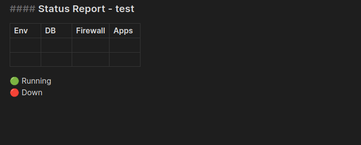

# Obsidian plugin: Paste from history

## Usage

Text you `copy` or `cut` will be tracked. You then have the ability to `paste` text from those previous _clipboard events_.

### Commands

#### Paste from clipboard history

Opens a menu displaying a list of recent clipboard texts which can be chosen to paste into the editor.

##### Hotkey

Choose a hotkey that fits well with your hotkeys. These works well for me:

-   Linux & Windows: Ctrl + Shift + V
-   Mac: Command + Shift + V

#### Clear clipboard history

Removes all entries from the plugin's history of the clipboard.

### Settings

#### History limit

You can adjust the limit of how many clipboard text events are tracked in the settings. Defaults to `16`.

#### History view

Two modes for clipboard history view.

- `hovered` - Menu floating above the editor. (Default)
- `docked` - Menu docked to the bottom of the editor.

#### Lines in preview

_Supported by `Docked` view_

Number of lines to reserve for multiline preview. Defaults to `6`.

## Limitations

-   Obsidian does not have access to the OS's clipboard which means clipboard events happening outside of Obsidian are not tracked in this plugin's clipboard history.
-   [Paste from clipboard history](#paste-from-clipboard-history) only works inside _editing view_.
-   Only text content is supported currently.
-   Clipboard history is kept in memory. Consequences:
    -   Clipboard history prior to plugin activation is not available.
    -   Clipboard history is lost between sessions.
    -   Clipboard history is not available between devices.

## Implementation details

Keeps a limited in-memory history of the text from clipboard `copy` and `cut` events seen by the `document` HTML DOM object in the Obsidian application.

## License

GNU LGPLv3

## Contribution

### Donation

Donations of any size are welcome and will allow me to dedicate more time towards community endeavors such as this project.

-   [Github Sponsors: Karakaz](https://github.com/sponsors/Karakaz)

### Bugs, feedback & ideas

Please feel free to open an [issue](https://github.com/Karakaz/obsidian-paste-from-history/issues) and I'll take a look.
